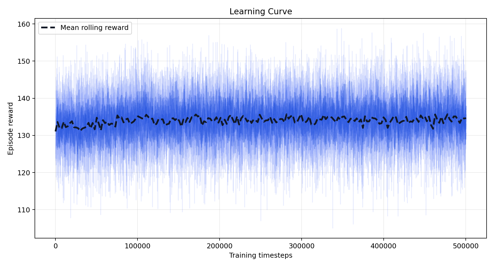
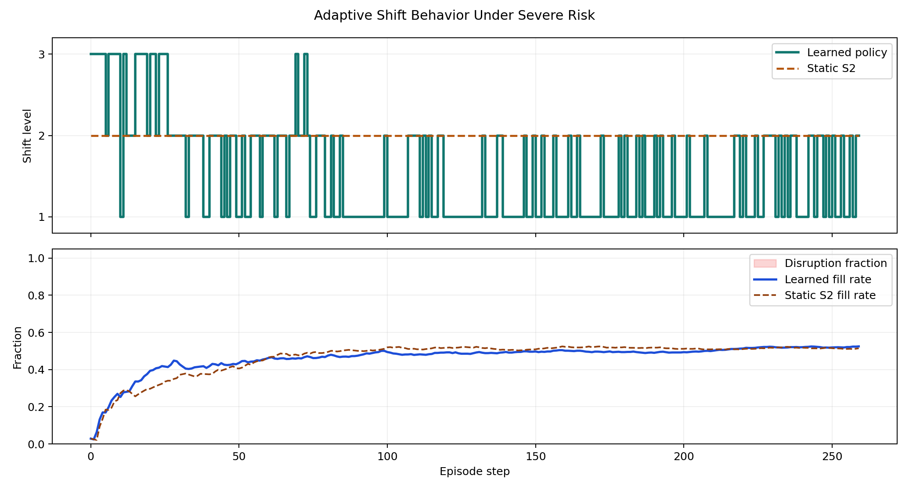
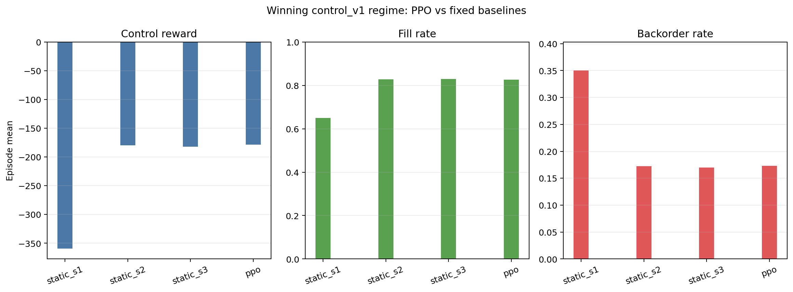

# SCRES-IA: Supply Chain Resilience Simulation

SCRES-IA rebuilds the Military Food Supply Chain (MFSC) simulation from
Garrido-Rios (2017) and extends it with reinforcement-learning experiments. The
repository combines a SimPy discrete-event simulation, Gymnasium-compatible
environments, validation scripts, and benchmark training runs for studying
supply-chain resilience as a capability that can be learned under disruption.

## Research Contribution

The project has two layers:

- a reproducible Python reconstruction of the original MFSC discrete-event
  model;
- a hybrid simulation-learning framework where policies can be trained and
  compared under controlled disruption scenarios.

The current manuscript lane focuses on resilience reward design, shift-control
experiments, stochastic processing times, and benchmark comparators tied back to
the thesis-aligned simulation outputs.

## Visual Evidence

| Learning curve | Disruption timeline | Policy comparison |
| --- | --- | --- |
|  |  |  |

## Repository Structure

```text
supply_chain/          Core package: config, DES engine, Gymnasium environments
scripts/               Diagnostic and analysis scripts
tests/                 Pytest suite
docs/                  Reproducibility notes, artifact maps, source references
outputs/               Generated plots, models, logs, reports
legacy/                Deprecated code kept for reference
```

## Recommended Python

Python `3.11` is recommended for package compatibility.

## Setup

```bash
python -m venv .venv
source .venv/bin/activate
python -m pip install --upgrade pip
python -m pip install -r requirements.txt
```

## Colab Imports

For notebooks, clone the repository into a folder named `scresia` and import
from the repository-root namespace:

```python
!git clone https://github.com/Thom-320/scres-ia.git /content/scresia

import sys
sys.path.insert(0, "/content")

from scresia.supply_chain import MFSCSimulation
from scresia.supply_chain.config import SIMULATION_HORIZON
from scresia.supply_chain.external_env_interface import make_track_b_env
```

If the notebook is already running from inside the repository directory, the
same `scresia.*` imports are supported by the local compatibility namespace.

## Run Simulation Baselines

```bash
# Deterministic baseline
python run_static.py --det-only --year-basis thesis

# Stochastic baseline
python run_static.py --sto-only --year-basis thesis --seed 42

# Combined comparison
python run_static.py --year-basis thesis
```

## Validation Report

```bash
python validation_report.py --official-basis thesis
```

The validation table is written to:

```text
outputs/validation/validation_table_dual_basis.csv
```

## Hybrid Model Training

Quick smoke run with the paper-facing defaults:

```bash
python train_agent.py --timesteps 20000 --n-envs 1 --seed 42 --year-basis thesis
```

Canonical Track B training (the current manuscript spine — PPO on the
`track_b_v1` 8D contract; artifacts and checkpoints in
`docs/REPRODUCIBILITY.md`):

```bash
python scripts/run_track_b_smoke.py \
  --reward-mode control_v1 \
  --observation-version v7 \
  --risk-level adaptive_benchmark_v2 \
  --max-steps 104 \
  --train-timesteps 60000 \
  --seeds 1 2 3 4 5 \
  --eval-episodes 12
```

Historical note: the earlier `shift_control`/`ReT_seq_v1` 500k lane
(`train_agent.py --env-variant shift_control ...`) predates the Track B era
and is retained for provenance only --- it is NOT the manuscript lane.

Artifacts are saved under `outputs/`: models, normalization statistics,
training curves, CSV files, and JSON summaries.

For the paper-facing benchmark lane and artifact map, see:

- `docs/REPOSITORY_SOURCE_OF_TRUTH.md`
- `docs/REPRODUCIBILITY.md`
- `docs/artifacts/control_reward/README.md`

## Diagnostic Scripts

```bash
python scripts/diagnostic_doe_alpha.py
python scripts/diagnostic_reward_spread.py
python scripts/diagnostic_doe_decompose.py
python scripts/diagnostic_action_impact.py
```

## Tests

```bash
pytest tests/
```

## Quality Checks

```bash
black .
ruff check . --fix
mypy supply_chain/
```

## Current Benchmark Defaults (Track B canonical)

- Action contract: `track_b_v1` (8D) via `make_track_b_env`
- Training reward: `control_v1`
- Observation version: `v7`
- Risk level: `adaptive_benchmark_v2`; horizon `h104` (weekly 168 h steps)
- Year basis: `thesis`; stochastic processing times: on
- Primary metric: `ret_excel` (Garrido/Excel ReT) --- never `ret_thesis`
- Authority when documents disagree: `docs/CLAIMS_REGISTRY_Q1_DEFENSE_2026-07-01.md`,
  then `docs/REPOSITORY_SOURCE_OF_TRUTH.md`

Historical (pre-Track-B, provenance only): the `ReT_seq_v1`/kappa 0.20/`v1`
shift-control lane and its `increased/severe + stochastic_pt` scenarios.
